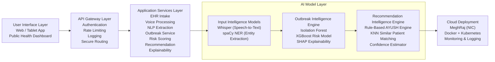
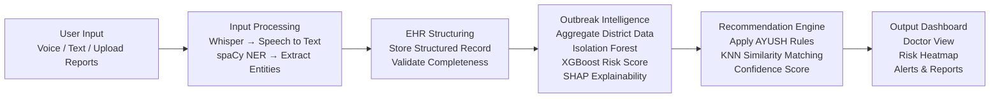

# AYU-INTEL  
## Explainable AI for AYUSH Public Health Intelligence

---

## 📌 Overview

AYU-INTEL is an Explainable AI-based Public Health Intelligence and Personalized AYUSH Decision Support System designed to enhance the Ayush Hospital Management Information System (AHMIS).

Over 12,000+ AYUSH centers generate large-scale clinical data across India. However, this data is primarily used for record-keeping rather than predictive intelligence, outbreak detection, or personalized treatment optimization.

AYU-INTEL transforms passive clinical records into actionable public health intelligence using:

- Voice-enabled EHR capture
- Anomaly-based outbreak detection
- Probabilistic risk modeling
- SHAP-based explainability
- Prakriti-aware personalized treatment recommendation

The system is scalable, interoperable with AHMIS, and designed for MeghRaj cloud deployment.

---

## 🚩 Problem Statement

### Current Challenges

- Manual and time-consuming EHR entry
- Underutilization of AYUSH clinical data
- No district-level outbreak intelligence
- No AI-driven personalized treatment support
- Limited transparency in predictive systems

### National Importance

- 12,000+ AYUSH centers across India
- Need for preventive healthcare intelligence
- Demand for explainable and responsible AI
- Data-driven governance in public health

---

## 🎯 Proposed Solution

AYU-INTEL consists of three core components:

1. Voice-Enabled EHR Capture  
2. Explainable Outbreak Intelligence Engine  
3. Prakriti-Aware Personalized Recommendation System  

The system uses a hybrid AI + rule-based architecture to ensure:

- Domain correctness
- Transparency
- Interpretability
- Scalability

---

# 🏗 System Architecture

Below is the high-level layered architecture of AYU-INTEL.

# 🔄 Technical Processing Flow

AYU-INTEL follows a structured multi-stage AI processing pipeline to transform raw clinical input into explainable intelligence and personalized care.

### Step 1: Voice & Text Input
Doctors input patient information via voice or text interfaces.
* **Model Used:** `Whisper` (Transformer-based ASR Model).
* **Function:** Converts audio input into high-accuracy text transcription.

### Step 2: Clinical Entity Extraction
The system processes the transcription to identify and structure medical data.
* **Model Used:** `spaCy` Named Entity Recognition (NER).
* **Extracted Entities:** Age, Gender, Diagnosis, Symptoms, Prakriti, Comorbidities, District, and Timestamp.
* **Storage:** Structured records are stored securely in the system's EHR database.

### Step 3: Feature Engineering & Aggregation
District-level patient data is aggregated to create predictive inputs for the intelligence engine.
* **Computed Metrics:** Weekly case counts, case growth rates, seasonal deviation index, and demographic clustering metrics.
* **Purpose:** These features form the foundation for predictive modeling.

### Step 4: Outbreak Detection
Identifying abnormal disease spikes by learning historical patterns.
* **Model Used:** `Isolation Forest`.
* **Logic:** If the anomaly threshold is exceeded, a potential outbreak event is flagged for the specific district.

### Step 5: Risk Probability Modeling
Converting anomaly signals into interpretable risk estimates.
* **Model Used:** `XGBoost Classifier`.
* **Function:** Processes engineered features and anomaly scores to compute a probability-based risk score (e.g., **0.82 / High Risk**).

### Step 6: Explainability (SHAP Integration)
Ensuring transparency and trust in AI-driven public health decisions.
* **Model Used:** `SHAP` TreeExplainer.
* **Function:** Provides feature-level contribution analysis for each risk prediction.
* **Insights:** Displays factors such as weekly case spike contribution, seasonal deviation impact, and demographic clustering effects.

### Step 7: Personalized Recommendation Engine
A dual-approach system for treatment optimization.
* **A. Rule-Based AYUSH Protocol Engine:** Encodes standardized guidelines mapping $Diagnosis + Prakriti + Season$ to specific treatment plans, dietary modifications, and Yoga practices.
* **B. Similar Patient Matching:** Uses `K-Nearest Neighbors (KNN)` to identify patients with similar conditions and Prakriti to improve personalization based on historical outcome similarity.

### Step 8: Final Output & Visualization
The processed intelligence is delivered through specialized dashboards.
* **Doctor Dashboard:** Personalized treatment plans, confidence scores, and feature contribution insights.
* **Public Health Dashboard:** District heatmaps, risk probability scores, SHAP explanations, and preventive action suggestions.

## 📊 Technical Flow Diagram

---

## 📂 Project Structure & Module Descriptions

The repository is organized to follow the structured technical pipeline. Each file represents a core component of the proposed AI Model Stack:

| File Name | AI Component | Description |
| :--- | :--- | :--- |
| `whisper_processor.py` | **Speech-to-Text** | Handles audio-to-text transcription for voice-enabled EHR capture. |
| `ner_extractor.py` | **Clinical Entity Extraction** | Uses spaCy to extract entities like Prakriti, Age, and Symptoms. |
| `outbreak_detector.py` | **Anomaly Detection** | Implements Isolation Forest to detect abnormal district-level disease spikes. |
| `risk_classifier.py` | **Risk Probability Modeling** | Uses XGBoost to compute probabilistic outbreak risk scores. |
| `explainability_engine.py` | **SHAP Explainability** | Provides feature-level transparency for AI-driven risk predictions. |
| `protocol_rules.py` | **AYUSH Protocol Logic** | A rule-based engine mapping diagnosis and Prakriti to treatments. |
| `patient_matcher.py` | **Similarity Matching** | Uses KNN to find similar historical patient cases for personalization. |

> **Note**: These modules are currently in the architectural setup phase and represent the planned implementation for the AYU-INTEL framework.
# ✅ Conclusion

AYU-INTEL presents a scalable, explainable, and domain-aligned AI framework for transforming AYUSH clinical data into actionable public health intelligence. By integrating anomaly detection, probabilistic risk modeling, SHAP-based transparency, and prakriti-aware personalized recommendations, the system bridges the gap between traditional AYUSH practices and modern AI-driven decision support. Designed with responsible AI principles, interoperability, and cloud scalability in mind, AYU-INTEL provides a realistic and deployable roadmap for strengthening preventive healthcare and data-driven governance across India’s 12,000+ AYUSH centers.

