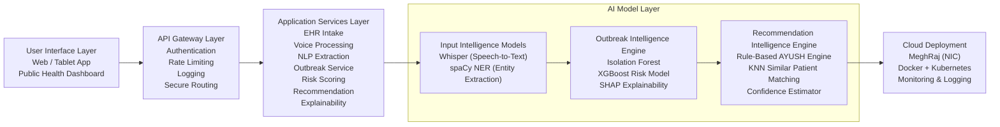

# AYU-INTEL  
## Explainable AI for AYUSH Public Health Intelligence

---

## 📌 Overview

AYU-INTEL is an Explainable AI-based Public Health Intelligence and Personalized AYUSH Decision Support System designed to enhance the Ayush Hospital Management Information System (AHMIS).

Over 12,000+ AYUSH centers generate large-scale clinical data across India. However, this data is primarily used for record-keeping rather than predictive intelligence, outbreak detection, or personalized treatment optimization.

AYU-INTEL transforms passive clinical records into actionable public health intelligence using:

- Voice-enabled EHR capture
- Anomaly-based outbreak detection
- Probabilistic risk modeling
- SHAP-based explainability
- Prakriti-aware personalized treatment recommendation

The system is scalable, interoperable with AHMIS, and designed for MeghRaj cloud deployment.

---

## 🚩 Problem Statement

### Current Challenges

- Manual and time-consuming EHR entry
- Underutilization of AYUSH clinical data
- No district-level outbreak intelligence
- No AI-driven personalized treatment support
- Limited transparency in predictive systems

### National Importance

- 12,000+ AYUSH centers across India
- Need for preventive healthcare intelligence
- Demand for explainable and responsible AI
- Data-driven governance in public health

---

## 🎯 Proposed Solution

AYU-INTEL consists of three core components:

1. Voice-Enabled EHR Capture  
2. Explainable Outbreak Intelligence Engine  
3. Prakriti-Aware Personalized Recommendation System  

The system uses a hybrid AI + rule-based architecture to ensure:

- Domain correctness
- Transparency
- Interpretability
- Scalability

---

# 🏗 System Architecture

Below is the high-level layered architecture of AYU-INTEL.


# 🔄 Technical Processing Flow

The system follows a structured multi-stage AI pipeline that transforms raw clinical input into explainable outbreak intelligence and personalized treatment recommendations.

### Step-by-Step Flow

1. **User Input**  
   Doctor enters patient data via voice, text, or uploaded reports.

2. **Input Processing Layer**  
   - Whisper converts speech to text.  
   - spaCy NER extracts structured clinical entities (age, symptoms, diagnosis, prakriti, location).

3. **EHR Structuring Layer**  
   - Structured patient record is stored in the database.  
   - Data completeness and validation checks are performed.

4. **Outbreak Intelligence Engine**  
   - District-level data is aggregated.  
   - Isolation Forest detects anomaly patterns.  
   - XGBoost computes outbreak risk probability.  
   - SHAP explains contributing features.

5. **Recommendation Engine**  
   - Rule-based AYUSH protocol engine generates guideline-aligned treatment.  
   - KNN identifies similar patients for personalization.  
   - Confidence score is calculated.

6. **Output Dashboard**  
   - Risk heatmap for administrators.  
   - Personalized treatment plan for doctors.  
   - Alerts and preventive action suggestions.

---

## 📊 Technical Flow Diagram

```mermaid
flowchart  LR

A["User Input
Voice / Text / Upload Reports"]

B["Input Processing
Whisper → Speech to Text
spaCy NER → Extract Entities"]

C["EHR Structuring
Store Structured Record
Validate Completeness"]

D["Outbreak Intelligence
Aggregate District Data
Isolation Forest
XGBoost Risk Score
SHAP Explainability"]

E["Recommendation Engine
Apply AYUSH Rules
KNN Similarity Matching
Confidence Score"]

F["Output Dashboard
Doctor View
Risk Heatmap
Alerts & Reports"]

A --> B --> C --> D --> E --> F
